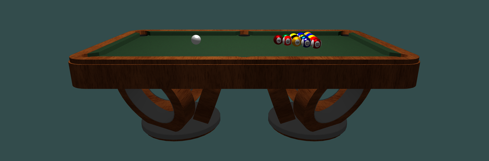

# 🎱3D-Billiards

ZJU CG2023 Final Project 



### Setup

Clone this repository

```bash
git clone git@github.com:Gansche/3D-Billiards.git
```

### Running

We have provided an executable file for you in the following path:

```bash
./bin/Billiard.exe
```

If you want to compile by yourself, you can open this project in CLion.

### How To Play

`Enter`: start the game.\
`Left Mouse Button`: rotate the camera.\
`Right Mouse Button`: forward or backward.\
`Mouse scroll wheel`: adjusting the intensity.\
`Caps`: switch to God's eye view.\
`Spacebar`: Hit the ball!


### Reference

> https://learnopengl-cn.github.io/
> 
> https://github.com/tinyobjloader/tinyobjloader.git
